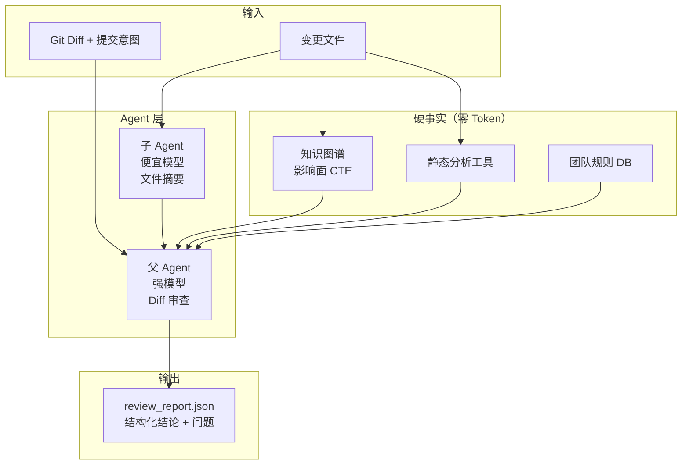
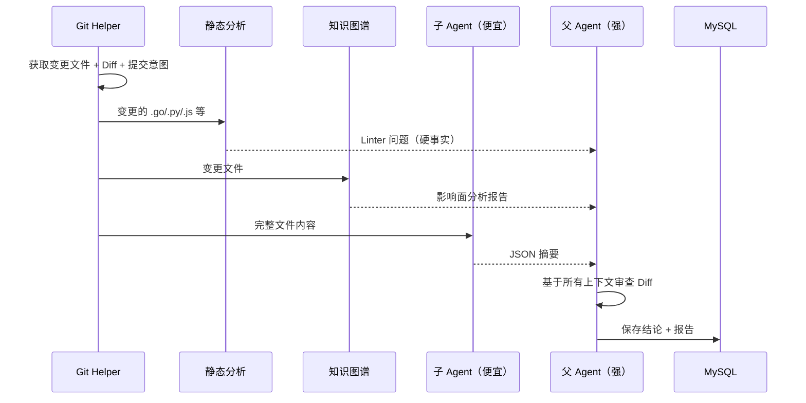

# Code Review Agent

**中文** | [English](README.md)

多模型支持、子 Agent 架构、Tree-sitter AST 知识图谱、结构化 JSON 输出的 AI 代码审查系统。

- [快速开始](#快速开始)
- [架构图](#架构图)
- [已实现 vs 设计蓝图](#已实现-vs-设计蓝图)
- [多模型支持](#多模型支持)
- [子 Agent + 父 Agent](#子-agent--父-agent)
- [代码知识图谱 & 影响面分析](#代码知识图谱--影响面分析)
- [Review 流水线](#review-流水线)
- [语言支持](#语言支持)
- [配置](#配置)
- [更新日志](#更新日志)

---

## 快速开始

```bash
# 1. 安装依赖
pip install -r requirements.txt

# 2. 设置 API key（默认 Kimi）
export LLM_API_KEY="sk-..."
export PROJECT_ROOT="/path/to/repo"

# 3. 运行 review
python main.py
```

输出：`review_report.json`，包含结构化的审查结论、问题列表和元数据。

CI/CD 退出码：
- `0` = 通过
- `1` = 阻断
- `2` = 警告

---

## 架构图



### 模块说明

```
main.py              -> 入口，配置校验，报告格式化
review_pipeline.py   -> 6 步流水线编排
git_helper.py        -> Git 操作（PR diff vs 分支，或 gerrit patch 模式）
linter_runner.py     -> 多语言静态分析调度 - 零 Token 成本
graph_builder.py     -> Tree-sitter AST + SQLite 知识图谱 + 影响面分析
logger.py            -> 彩色控制台 + 文件日志
config.py            -> 统一环境变量配置
llm_client.py        -> OpenAI 兼容 HTTP 客户端（Kimi、DeepSeek、Claude、OpenAI）

db/
  db.py              -> MySQL 持久化团队规则和审查历史

agents/
  summarizer.py      -> 子 Agent：便宜模型读取完整文件，输出 JSON 摘要
  reviewer.py        -> 父 Agent：强模型基于上下文审查 Diff
```

---

## 已实现 vs 设计蓝图

| 蓝图能力 | 状态 | 实现 |
|---------------------|--------|----------------|
| Tree-sitter AST 解析 | **已完成** | `graph_builder.py:MultiLangParser` 提取函数/方法/类/结构体/接口/调用/导入 |
| SQLite 图存储 | **已完成** | `GraphStore` 支持 WAL 模式、事务、批量查询 |
| 增量更新 | **已完成** | SHA-256 hash 检测，只重新解析变更文件 |
| 影响面分析（爆炸半径） | **已完成** | SQLite 递归 CTE BFS 遍历 CALLS/CONTAINS/INHERITS/IMPLEMENTS 边 |
| 子 Agent + 父 Agent | **已完成** | `agents/summarizer.py` + `agents/reviewer.py` |
| 静态分析优先 | **已完成** | linter 在任何 LLM 调用之前执行 |
| 多模型支持 | **已完成** | `llm_client.py` 支持任意 OpenAI 兼容端点 |
| 结构化 JSON 输出 | **已完成** | `response_format={"type": "json_object"}` |
| 团队规则（DB） | **已完成** | MySQL 表 + JSON 同步 |
| Gerrit patch 模式 | **已完成** | `GIT_MODE=patch` 只审查 HEAD commit |
| 多语言支持 | **已完成** | Go/Python/JS/TS/TSX/Rust/Java/C/C++ 等（要求安装 tree-sitter-language-pack） |
| RAG / 向量检索 | 待实现 | Milvus/PGVector 尚未集成 |
| Critic Agent | 待实现 | 自我校正循环尚未实现 |
| 查询扩展 / Hyde | 待实现 | 假设性文档生成尚未实现 |
| 跨文件调用解析 | 部分完成 | 已存储未限定名称调用，全局解析推迟 |

---

## 多模型支持

默认使用 **Kimi**。通过环境变量切换模型：

```bash
# Kimi（默认）
export LLM_PROVIDER="kimi"
export LLM_API_KEY="sk-..."

# DeepSeek
export LLM_PROVIDER="deepseek"
export LLM_API_KEY="sk-..."

# Claude（OpenAI 兼容格式）
export LLM_PROVIDER="claude"
export LLM_API_KEY="sk-ant-..."
export LLM_BASE_URL="https://api.anthropic.com/v1"

# OpenAI
export LLM_PROVIDER="openai"
export LLM_API_KEY="sk-..."
```

子 Agent（摘要）可以使用更便宜的模型：
```bash
export SUB_LLM_PROVIDER="kimi"
export SUB_LLM_MODEL="kimi-k2-5"  # 或更便宜的 endpoint
```

---

## 子 Agent + 父 Agent

**节省 Token 的架构**。

1. **子 Agent（便宜/轻量模型）**：读取每个变更文件的**完整内容**，输出紧凑的 JSON 摘要（模块目的、关键函数、依赖、风险点）。这是便宜的因为只是简单的提取任务。

2. **父 Agent（强模型）**：只接收 **Diff** + **摘要** + **静态分析** + **影响面** + **团队规则**。它专注于深度审查逻辑，无需浪费 token 读取完整文件。

效果：强模型看到的 token 比"直接倒入整个文件"的方案减少约 80%。

---

## 代码知识图谱 & 影响面分析

**之前（原始版本）**：基于正则的函数名提取 + pickle 缓存。只知道"这个文件有这些函数"，没有任何关系。

**现在（Phase 1）**：

```python
# SQLite 模式
nodes: kind, name, qualified_name, file_path, line_start, line_end, parent_name, params, is_test, file_hash
edges: kind, source_qualified, target_qualified, file_path, line
```

从 AST 提取的边：
- `CONTAINS`: 文件 -> 函数/方法/结构体/接口
- `CALLS`: 函数 -> 函数（同文件已解析，跨文件存储未限定名）
- `IMPORTS_FROM`: 文件 -> 包

**影响面分析（爆炸半径）**：
给定变更文件，图谱通过边追踪所有调用方、依赖方和继承类型，在 N 跳内：

```
## Impact Analysis (Blast Radius)
- Changed nodes: 3
- Impacted nodes: 12
- Impacted files: 5

- `service/profile/checker.go`
- `service/profile/validator.go`
- `api/handler/profile.go`
- ... and 2 more
```

LLM 审查时会收到这个上下文，从而提问：*"你修改了 `ValidateUser`，检查过调用它的 5 个文件了吗？"*

---

## Review 流水线



### 6 步流程

```
Step 0: Git 发现
        -> 变更文件、Diff、提交意图

Step 1: 静态分析（零 Token）
        -> 对变更文件运行相应语言的 Linter
        -> 硬事实输入 LLM

Step 2: 团队规则
        -> 从 MySQL / team_rules.json 加载

Step 2.5: 影响面分析（零 Token）
        -> 增量更新知识图谱
        -> SQLite 递归 CTE BFS 计算爆炸半径
        -> 硬上下文输入 LLM

Step 3: 子 Agent 摘要（便宜）
        -> 读取完整变更文件
        -> 输出 JSON 摘要

Step 4: 父 Agent 审查（强）
        -> Diff + 摘要 + 静态分析 + 影响面 + 规则
        -> 结构化 JSON 输出（结论 + 问题列表）

Step 5: 持久化
        -> 保存到 review_report.json + MySQL
```

---

## 语言支持

| 能力 | 支持语言 |
|-----|---------|
| **AI Review (LLM)** | **任意语言** — LLM 直接读取 diff，与语言无关 |
| **静态分析** | **Go, Python, JavaScript/TypeScript, Rust, Java, C/C++** — 通过 `linter_runner.py` 多语言调度 |
| **知识图谱** | **Go, Python, JavaScript/TypeScript/TSX, Rust, Java, C/C++** — 通过 `tree-sitter-language-pack` 解析 |
| **影响面分析** | **与知识图谱同步** — 需要先有图谱数据 |

Tree-sitter 解析器自动根据文件扩展名选择语言：

```python
EXT_TO_LANG = {
    ".go": "go",
    ".py": "python",
    ".js": "javascript", ".jsx": "javascript",
    ".ts": "typescript", ".tsx": "tsx",
    ".rs": "rust",
    ".java": "java",
    ".c": "c", ".h": "c",
    ".cpp": "cpp", ".cc": "cpp", ".hpp": "cpp",
    ".cs": "csharp",
    ".rb": "ruby",
    ".php": "php",
    ".swift": "swift",
    ".kt": "kotlin",
    ".scala": "scala",
    ".dart": "dart",
    ".r": "r",
}
```

未安装 `tree-sitter-language-pack` 时，自动回退到基于正则的简单解析。

---

## 配置

所有配置都通过环境变量设置：

| 变量 | 默认值 | 说明 |
|----------|---------|-------------|
| `LLM_PROVIDER` | `kimi` | 主模型提供商 |
| `LLM_API_KEY` | - | API key |
| `LLM_MODEL` | provider 默认 | 覆盖模型名称 |
| `SUB_LLM_PROVIDER` | 与主模型相同 | 子 Agent 提供商 |
| `PROJECT_ROOT` | `cwd` | Git 仓库路径 |
| `ENABLE_LINTER` | `true` | 启用静态分析 |
| `ENABLE_KG` | `true` | 启用知识图谱 |
| `GIT_MODE` | `pr` | `pr` (对比分支) 或 `patch` (HEAD commit) |
| `TARGET_BRANCH` | `origin/main` | PR 模式的目标分支 |
| `OUTPUT_FORMAT` | `json` | `json` 或 `markdown` |
| `RULES_JSON_PATH` | `team_rules.json` | 团队规则文件 |

---

## 更新日志

### Phase 1 — Tree-sitter + SQLite + 影响面 + 多语言

**新增/修改的文件：**
- `config.py` — 新增：统一环境变量配置，支持多模型和子 Agent
- `llm_client.py` — 新增：OpenAI 兼容通用 HTTP 客户端
- `agents/summarizer.py` — 新增：子 Agent 文件摘要
- `agents/reviewer.py` — 新增：父 Agent 结构化审查
- `review_pipeline.py` — 新增：6 步流水线编排
- `graph_builder.py` — **重写**：Tree-sitter AST + SQLite + 影响面 CTE + 多语言 dispatch
- `main.py` — **重写**：简化入口，CI 退出码
- `git_helper.py` — 增强：添加 gerrit 单 commit 模式
- `linter_runner.py` — 增强：多语言 linter 调度框架
- `requirements.txt` — 更新：添加 `tree-sitter-language-pack`
- `.claude/CLAUDE.md` — 新增：项目开发文档
- `.devlog/phase1.md` — 新增：Phase 1 设计决策日志

**关键设计决策：**
1. `tree-sitter-language-pack` 选择单一依赖包覆盖23+语言
2. SQLite WAL 模式支持并发读写
3. 影响面 CTE 仅遍历 CALLS/CONTAINS/INHERITS/IMPLEMENTS 边
4. 跨文件调用存储为未限定名称，全局解析推迟到后续阶段
5. SHA-256 替代 MD5 作为文件变更检测

### 初始版本
- 基于 DeepSeek 的硬编码 prompt
- 正则解析的 `graph_builder.py` + pickle 缓存
- `linter_runner.py` 运行 golangci-lint
- `db/db.py` 管理 MySQL 团队规则
- `git_helper.py` 提取 git diff
