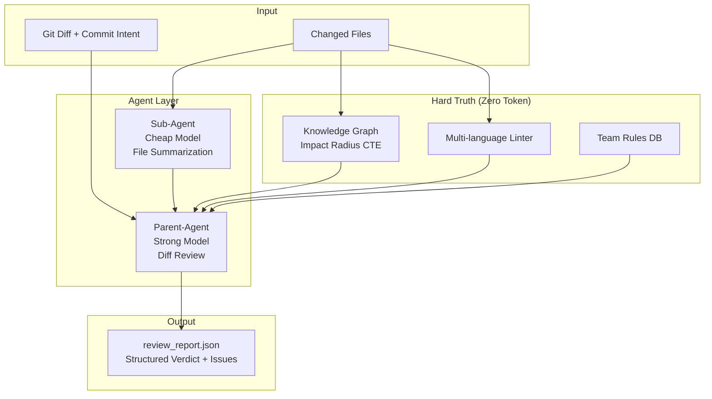

# Code Review Agent

[中文](README-zh.md) | **English**

AI-powered code review system with multi-model support, sub-agent architecture,
Tree-sitter AST knowledge graph, and structured JSON output.

- [Quick Start](#quick-start)
- [Architecture](#architecture)
- [Implemented vs Design Blueprint](#implemented-vs-design-blueprint)
- [Multi-Model Support](#multi-model-support)
- [Sub-Agent + Parent-Agent](#sub-agent--parent-agent)
- [Code Knowledge Graph & Impact Radius](#code-knowledge-graph--impact-radius)
- [Review Pipeline](#review-pipeline)
- [Configuration](#configuration)
- [Change Log](#change-log)

## Architecture Diagram



---

## Quick Start

```bash
# 1. Install dependencies
pip install -r requirements.txt

# 2. Set API key (Kimi is default)
export LLM_API_KEY="sk-..."
export PROJECT_ROOT="/path/to/go/repo"

# 3. Run review
python main.py
```

Output: `review_report.json` with structured verdict, issues, and metadata.

Exit codes for CI/CD:
- `0` = PASS
- `1` = BLOCKER
- `2` = WARN

---

## Architecture

```
main.py              -> Entry point, config validation, report formatting
review_pipeline.py   -> 6-step orchestration pipeline
git_helper.py        -> Git operations (PR diff vs branch, or gerrit patch mode)
linter_runner.py     -> Static analysis (golangci-lint) - ZERO token cost
graph_builder.py     -> Tree-sitter AST + SQLite knowledge graph + Impact Radius
logger.py            -> Colored console + file logging
config.py            -> Unified env-var based configuration
llm_client.py        -> OpenAI-compatible HTTP client (Kimi, DeepSeek, Claude, OpenAI)

db/
  db.py              -> MySQL persistence for team rules and review history

agents/
  summarizer.py      -> Sub-agent: cheap model reads full files, outputs JSON summaries
  reviewer.py        -> Parent-agent: strong model reviews diff with all context
```

---

## Implemented vs Design Blueprint

| Blueprint Capability | Status | Implementation |
|---------------------|--------|----------------|
| Tree-sitter AST parsing | **Done** | `graph_builder.py:GoParser` extracts func/method/struct/interface/calls/imports |
| SQLite graph storage | **Done** | `GraphStore` with WAL mode, nodes + edges tables |
| Incremental updates | **Done** | SHA-256 hash check, only re-parse changed files |
| Impact Radius (Blast Radius) | **Done** | SQLite recursive CTE BFS on CALLS/CONTAINS/INHERITS/IMPLEMENTS edges |
| Sub-agent + Parent-agent | **Done** | `agents/summarizer.py` + `agents/reviewer.py` |
| Static analysis first | **Done** | Linter runs before any LLM call |
| Multi-model support | **Done** | `llm_client.py` supports any OpenAI-compatible endpoint |
| Structured JSON output | **Done** | `response_format={"type": "json_object"}` |
| Team rules (DB) | **Done** | MySQL table + JSON sync |
| Gerrit patch mode | **Done** | `GIT_MODE=patch` reviews HEAD commit only |
| RAG / Vector retrieval | Pending | Milvus/PGVector not yet integrated |
| Critic Agent | Pending | Self-correction loop not yet implemented |
| Query Expansion / Hyde | Pending | No hypothetical document generation yet |
| Cross-file call resolution | Partial | Bare-name calls stored; full resolution deferred |

---

## Multi-Model Support

Default provider is **Kimi** (`kimi-k2-5`). Switch models via env var:

```bash
# Kimi (default)
export LLM_PROVIDER="kimi"
export LLM_API_KEY="sk-..."

# DeepSeek
export LLM_PROVIDER="deepseek"
export LLM_API_KEY="sk-..."

# Claude (OpenAI-compatible endpoint)
export LLM_PROVIDER="claude"
export LLM_API_KEY="sk-ant-..."
export LLM_BASE_URL="https://api.anthropic.com/v1"

# OpenAI
export LLM_PROVIDER="openai"
export LLM_API_KEY="sk-..."
```

Sub-agent (summarizer) can use a different/cheaper model:
```bash
export SUB_LLM_PROVIDER="kimi"
export SUB_LLM_MODEL="kimi-k2-5"  # or cheaper endpoint
```

---

## Sub-Agent + Parent-Agent

**Token-saving architecture** inspired by cost-conscious design:

1. **Sub-Agent (cheap/light model)**: Reads the **full content** of every changed file and produces a compact JSON summary (module purpose, key functions, dependencies, risk flags). This is cheap because it's a simple extraction task.

2. **Parent-Agent (strong model)**: Receives only the **diff** + **summaries** + **static analysis** + **impact radius** + **team rules**. It focuses on deep review logic without burning tokens on reading full files.

Result: Strong model sees ~80% less tokens vs naive "dump entire files into prompt" approach.

---

## Code Knowledge Graph & Impact Radius

**Before (original)**: Regex-based parsing + pickle cache. Only knew "this file has these function names". No relationships.

**After (Phase 1)**:

```python
# SQLite schema
nodes: kind, name, qualified_name, file_path, line_start, line_end, parent_name, params, is_test, file_hash
edges: kind, source_qualified, target_qualified, file_path, line
```

Edges extracted from AST:
- `CONTAINS`: File -> Function/Method/Struct/Interface
- `CALLS`: Function -> Function (intra-file resolved, cross-file bare name)
- `IMPORTS_FROM`: File -> Package

**Impact Radius (Blast Radius)**:
Given a changed file, the graph traces all callers, dependents, and inherited types within N hops:

```bash
# Example output in review context
## Impact Analysis (Blast Radius)
- Changed nodes: 3
- Impacted nodes: 12
- Impacted files: 5

- `service/profile/checker.go`
- `service/profile/validator.go`
- `api/handler/profile.go`
- ... and 2 more
```

The reviewer LLM uses this to ask: *"You changed `ValidateUser` — did you check all 5 files that call it?"*

---

## Review Pipeline

```mermaid
sequenceDiagram
    participant Git as Git Helper
    participant Linter as Static Analysis
    participant KG as Knowledge Graph
    participant Sub as Sub-Agent (Cheap)
    parent Sub
    participant Parent as Parent-Agent (Strong)
    participant DB as MySQL

    Git->>Git: Get changed files + diff + intent
    Git->>Linter: Changed .go files
    Linter-->>Parent: Linter issues (hard truth)
    Git->>KG: Changed files
    KG-->>Parent: Impact radius report
    Git->>Sub: Full file contents
    Sub-->>Parent: JSON summaries
    Parent->>Parent: Review diff with all context
    Parent->>DB: Save verdict + report
```

```
Step 0: Git Discovery
        -> changed files, diff, commit intent

Step 1: Static Analysis (ZERO tokens)
        -> golangci-lint on changed files
        -> Hard truth fed to LLM

Step 2: Team Rules
        -> Load from MySQL / team_rules.json

Step 2.5: Impact Radius (ZERO tokens)
        -> Update knowledge graph for changed files
        -> SQLite recursive CTE BFS for blast radius
        -> Hard context fed to LLM

Step 3: Sub-Agent Summarization (cheap)
        -> Read full changed files
        -> Output JSON summaries

Step 4: Parent-Agent Review (strong)
        -> Diff + summaries + static analysis + impact + rules
        -> Structured JSON output (verdict + issues)

Step 5: Persistence
        -> Save to review_report.json + MySQL
```

---

## Language Support

| Capability | Supported Languages |
|-----------|---------------------|
| **AI Review (LLM)** | **Any language** — LLM reads diff directly, language-agnostic |
| **Static Analysis** | **Go, Python, JavaScript/TypeScript, Rust, Java, C/C++** — dispatched via `linter_runner.py` |
| **Knowledge Graph** | **Go, Python, JavaScript/TypeScript/TSX, Rust, Java, C/C++** — via `tree-sitter-language-pack` |
| **Impact Radius** | **Same as Knowledge Graph** — requires graph data |

Tree-sitter parser is auto-selected by file extension:

```python
EXT_TO_LANG = {
    ".go": "go",
    ".py": "python",
    ".js": "javascript", ".jsx": "javascript",
    ".ts": "typescript", ".tsx": "tsx",
    ".rs": "rust",
    ".java": "java",
    ".c": "c", ".h": "c",
    ".cpp": "cpp", ".cc": "cpp", ".hpp": "cpp",
    ".cs": "csharp",
    ".rb": "ruby",
    ".php": "php",
    ".swift": "swift",
    ".kt": "kotlin",
    ".scala": "scala",
    ".dart": "dart",
    ".r": "r",
}
```

When `tree-sitter-language-pack` is not installed, the system falls back to regex-based parsing.

---

## Configuration

All settings via environment variables:

| Variable | Default | Description |
|----------|---------|-------------|
| `LLM_PROVIDER` | `kimi` | Primary LLM provider |
| `LLM_API_KEY` | - | API key |
| `LLM_MODEL` | provider default | Override model name |
| `SUB_LLM_PROVIDER` | same as primary | Sub-agent provider |
| `PROJECT_ROOT` | `cwd` | Path to git repository |
| `ENABLE_LINTER` | `true` | Run static analysis |
| `ENABLE_KG` | `true` | Build/use knowledge graph |
| `GIT_MODE` | `pr` | `pr` (diff vs branch) or `patch` (HEAD commit) |
| `TARGET_BRANCH` | `origin/main` | Target branch for PR mode |
| `OUTPUT_FORMAT` | `json` | `json` or `markdown` |
| `RULES_JSON_PATH` | `team_rules.json` | Team rules file |

---

## Change Log

### Phase 1 (Current) — Tree-sitter + SQLite + Impact Radius

**Files added/modified:**
- `config.py` — New: unified env-var configuration with multi-model support
- `llm_client.py` — New: OpenAI-compatible generic HTTP client
- `agents/summarizer.py` — New: sub-agent for file summarization
- `agents/reviewer.py` — New: parent-agent for structured review
- `review_pipeline.py` — New: 6-step orchestration pipeline
- `graph_builder.py` — **Rewritten**: Tree-sitter AST + SQLite + Impact Radius CTE
- `main.py` — **Rewritten**: simplified entry point with CI exit codes
- `git_helper.py` — Enhanced: added `get_latest_commit_files/diff` for gerrit mode
- `requirements.txt` — Updated: added `tree-sitter-language-pack`
- `.claude/CLAUDE.md` — New: project development documentation
- `.devlog/phase1.md` — New: Phase 1 design decisions log

**Key design decisions:**
1. `tree-sitter-language-pack` chosen over individual grammar packages for single-dependency convenience
2. SQLite WAL mode for concurrent reads during write
3. Impact Radius CTE only traverses CALLS/CONTAINS/INHERITS/IMPLEMENTS edges
4. Bare-name call targets: cross-file calls stored as unqualified names; resolution deferred to future phase
5. SHA-256 hashes replace MD5 for file change detection

### Initial Commit
- Basic DeepSeek integration with hardcoded prompt
- Regex-based `graph_builder.py` with pickle cache
- `linter_runner.py` for golangci-lint
- `db/db.py` for MySQL team rules
- `git_helper.py` for git diff extraction
